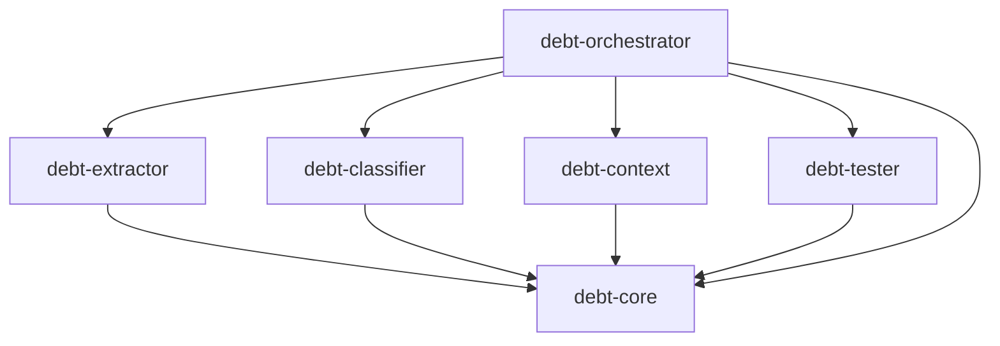

# Debt2Test

Debt2Test is a research proof of concept that automates discovery and repayment of **Self-Admitted Technical Debt (SATD)** in Java repositories. It is being built to support a master's-degree study, so the codebase favors clarity, explicit provenance, and reproducibility over shortcuts.

Given a Java repository, the pipeline:

1. **Clones** the repository (`debt-extractor`, via JGit).
2. **Extracts** SATD candidates from source comments via AST parsing (`debt-extractor`, via JavaParser).
3. **Classifies** each candidate with a pretrained Weka model (binary + multi-class DebtHunter models) (`debt-classifier`).
4. **Enriches** SATD candidates with external issue-tracker context, where available (`debt-context`).
5. **Generates** candidate JUnit 5 tests via an LLM (OpenAI, Anthropic, or Gemini) (`debt-tester`).
6. **Reports** the run as JSON/Markdown artifacts (`debt-orchestrator`).

## Architecture

The project is a Maven multi-module reactor using a ports-and-adapters (hexagonal) architecture:



```
debt-core          domain models, stage ports (interfaces), result types, errors — no I/O, no provider SDKs
debt-extractor      SatdExtractor + RepositoryWorkspaceProvider impls (JGit clone, JavaParser AST extraction)
debt-classifier     DebtClassifier impl (Weka DebtHunter binary + multi-class models)
debt-context        ContextEnricher impl (issue-reference extraction + provider chain)
debt-tester         TestGenerator impl (OpenAI / Anthropic / Gemini adapters)
debt-orchestrator   composition root: CLI entry point, pipeline sequencing, report writing
```

`debt-extractor`, `debt-classifier`, `debt-context`, and `debt-tester` never depend on each other — they only implement `debt-core` port interfaces. Only `debt-orchestrator` wires concrete implementations together.

See [`architecture.md`](architecture.md) for the full target architecture, module responsibilities, and contribution guide.

## Requirements

- Java 25
- Maven

## Building

```bash
# Build the whole reactor
mvn install

# Run all tests
mvn test

# Run tests for a single module
mvn -pl debt-extractor test
```

## Configuring the LLM provider

Test generation calls an LLM. Configure it via environment variables or a local `.env` file (see [`.env.example`](.env.example)):

| Variable               | Description                        | Default                           |
| ---------------------- | ---------------------------------- | --------------------------------- |
| `DEBT_TESTER_PROVIDER` | `openai`, `anthropic`, or `gemini` | `openai`                          |
| `DEBT_TESTER_API_KEY`  | API key for the selected provider  | _(empty)_                         |
| `DEBT_TESTER_MODEL`    | Model name                         | provider-specific (e.g. `gpt-4o`) |
| `DEBT_TESTER_ENDPOINT` | Override API endpoint              | provider default                  |

Never commit a `.env` file with real credentials.

```bash
cp .env.example .env
# edit .env with your API key
```

## Running the CLI

No `exec` plugin is declared on any module's `pom.xml`, so invoke it by full plugin coordinates from the repo root:

```bash
mvn -pl debt-orchestrator -am compile org.codehaus.mojo:exec-maven-plugin:3.1.0:java \
  -Dexec.mainClass=io.github.jonasfortes12.orchestrator.AppOrchestrator \
  -Dexec.args="<repositoryUrl> <binaryModelPath> <multiModelPath> <outputDirectory> <runId> <revision>"
```

All arguments are positional and optional — each falls back to a default if omitted or left blank:

| Position | Argument          | Default                                                |
| -------- | ----------------- | ------------------------------------------------------ |
| 1        | `repositoryUrl`   | `https://github.com/apache/dubbo`                      |
| 2        | `binaryModelPath` | `preTrainedModels/DHbinaryClassifier.model`            |
| 3        | `multiModelPath`  | `preTrainedModels/DHmultiClassifier.model`             |
| 4        | `outputDirectory` | `output/`                                              |
| 5        | `runId`           | automatically derived from inputs (deterministic hash) |
| 6        | `revision`        | repository's default branch                            |

### Example: run against the default repository with pretrained models

```bash
mvn -pl debt-orchestrator -am compile org.codehaus.mojo:exec-maven-plugin:3.1.0:java \
  -Dexec.mainClass=io.github.jonasfortes12.orchestrator.AppOrchestrator
```

### Example: run against a specific repository and output directory

```bash
mvn -pl debt-orchestrator -am compile org.codehaus.mojo:exec-maven-plugin:3.1.0:java \
  -Dexec.mainClass=io.github.jonasfortes12.orchestrator.AppOrchestrator \
  -Dexec.args="https://github.com/apache/commons-lang preTrainedModels/DHbinaryClassifier.model preTrainedModels/DHmultiClassifier.model output/commons-lang"
```

### Output

Each run writes report artifacts to the output directory:

- `debt-report.json` — extracted/classified SATD candidates
- `debt-test-report.json` — generated tests with provenance
- `debt-test-report.md` — human-readable summary

The process exits `0` on success (`COMPLETED`), `1` on pipeline failure (`FAILED`/`COMPLETED_WITH_ERRORS`), or `2` on invalid CLI arguments.

## Pretrained models

Binary and multi-class DebtHunter classifier models are expected under [`preTrainedModels/`](preTrainedModels/) by default (`DHbinaryClassifier.model`, `DHmultiClassifier.model`). Point `binaryModelPath`/`multiModelPath` elsewhere if you have your own.
