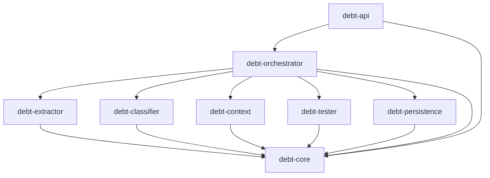

# Debt2Test

Debt2Test is a research proof of concept that automates discovery and repayment of **Self-Admitted Technical Debt (SATD)** in Java repositories. It is being built to support a master's-degree study, so the codebase favors clarity, explicit provenance, and reproducibility over shortcuts.

Given a Java repository, the pipeline:

1. **Clones** the repository (`debt-extractor`, via JGit).
2. **Extracts** SATD candidates from source comments via AST parsing (`debt-extractor`, via JavaParser).
3. **Classifies** each candidate with a pretrained Weka model (binary + multi-class DebtHunter models) (`debt-classifier`).
4. **Enriches** SATD candidates with external issue-tracker context, where available (`debt-context`).
5. **Generates** candidate JUnit 5 tests via an LLM (OpenAI, Anthropic, or Gemini) (`debt-tester`).
6. **Reports** the run as JSON/Markdown artifacts (`debt-orchestrator`).

## Architecture

The project is a Maven multi-module reactor using a ports-and-adapters (hexagonal) architecture:


```mermaid
graph TD
    CORE[debt-core]
    EXTRACTOR[debt-extractor]
    CLASSIFIER[debt-classifier]
    CONTEXT[debt-context]
    TESTER[debt-tester]
    PERSISTENCE[debt-persistence]
    ORCH[debt-orchestrator]
    API[debt-api]

    EXTRACTOR --> CORE
    CLASSIFIER --> CORE
    CONTEXT --> CORE
    TESTER --> CORE
    PERSISTENCE --> CORE
    ORCH --> CORE
    ORCH --> EXTRACTOR
    ORCH --> CLASSIFIER
    ORCH --> CONTEXT
    ORCH --> TESTER
    ORCH --> PERSISTENCE
    API --> CORE
    API --> ORCH
```

```
debt-core          domain models, stage ports (interfaces), result types, errors — no I/O, no provider SDKs
debt-extractor      SatdExtractor + RepositoryWorkspaceProvider impls (JGit clone, JavaParser AST extraction)
debt-classifier     DebtClassifier impl (Weka DebtHunter binary + multi-class models)
debt-context        ContextEnricher impl (issue-reference extraction + provider chain)
debt-tester         TestGenerator impl (OpenAI / Anthropic / Gemini adapters)
debt-persistence    PipelineRunStore + DatabaseReportSink impls (Flyway-managed PostgreSQL); opt-in via DEBT_PERSISTENCE_ENABLED
debt-orchestrator   composition root: CLI entry point, pipeline sequencing, report writing
debt-api            Spring Boot module exposing the pipeline over HTTP (create/status/report/cancel a run); depends only on debt-core + debt-orchestrator
```

`debt-extractor`, `debt-classifier`, `debt-context`, `debt-tester`, and `debt-persistence` never depend on each other — they only implement `debt-core` port interfaces. Only `debt-orchestrator` wires concrete implementations together, and `debt-api` depends on it to run the pipeline asynchronously behind 4 REST endpoints.

See [`architecture.md`](architecture.md) for the full target architecture, module responsibilities, and contribution guide.

## Requirements

- Java 25
- Maven
- Docker (only for the local PostgreSQL used by persistence and `debt-api`)

## Building

```bash
# Build the whole reactor
mvn install

# Run all tests
mvn test

# Run tests for a single module
mvn -pl debt-extractor test
```

## Configuring the LLM provider

Test generation calls an LLM. Configure it via environment variables or a local `.env` file (see [`.env.example`](.env.example)):

| Variable               | Description                        | Default                           |
| ---------------------- | ---------------------------------- | --------------------------------- |
| `DEBT_TESTER_PROVIDER` | `openai`, `anthropic`, or `gemini` | `openai`                          |
| `DEBT_TESTER_API_KEY`  | API key for the selected provider  | _(empty)_                         |
| `DEBT_TESTER_MODEL`    | Model name                         | provider-specific (e.g. `gpt-4o`) |
| `DEBT_TESTER_ENDPOINT` | Override API endpoint              | provider default                  |

Never commit a `.env` file with real credentials.

```bash
cp .env.example .env
# edit .env with your API key
```

## Running the CLI

No `exec` plugin is declared on any module's `pom.xml`, so invoke it by full plugin coordinates. Because `exec:java` isn't bound to a lifecycle phase, running it with `-am` executes it once per reactor module — including the root aggregator POM, which fails first since it has no classpath. Install the reactor once, then run `exec:java` scoped to just `debt-orchestrator` (no `-am`):

```bash
mvn install

mvn -pl debt-orchestrator compile org.codehaus.mojo:exec-maven-plugin:3.1.0:java \
  -Dexec.mainClass=io.github.jonasfortes12.orchestrator.AppOrchestrator \
  -Dexec.args="<repositoryUrl> <binaryModelPath> <multiModelPath> <outputDirectory> <runId> <revision>"
```

All arguments are positional and optional — each falls back to a default if omitted or left blank:

| Position | Argument          | Default                                                |
| -------- | ----------------- | ------------------------------------------------------ |
| 1        | `repositoryUrl`   | `https://github.com/apache/dubbo`                      |
| 2        | `binaryModelPath` | `preTrainedModels/DHbinaryClassifier.model`            |
| 3        | `multiModelPath`  | `preTrainedModels/DHmultiClassifier.model`             |
| 4        | `outputDirectory` | `output/`                                              |
| 5        | `runId`           | automatically derived from inputs (deterministic hash) |
| 6        | `revision`        | repository's default branch                            |

### Example: run against the default repository with pretrained models

```bash
mvn -pl debt-orchestrator compile org.codehaus.mojo:exec-maven-plugin:3.1.0:java \
  -Dexec.mainClass=io.github.jonasfortes12.orchestrator.AppOrchestrator
```

### Example: run against a specific repository and output directory

```bash
mvn -pl debt-orchestrator compile org.codehaus.mojo:exec-maven-plugin:3.1.0:java \
  -Dexec.mainClass=io.github.jonasfortes12.orchestrator.AppOrchestrator \
  -Dexec.args="https://github.com/apache/commons-lang preTrainedModels/DHbinaryClassifier.model preTrainedModels/DHmultiClassifier.model output/commons-lang"
```

### Output

Each run writes report artifacts to the output directory:

- `debt-report.json` — extracted/classified SATD candidates
- `debt-test-report.json` — generated tests with provenance
- `debt-test-report.md` — human-readable summary

The process exits `0` on success (`COMPLETED`), `1` on pipeline failure (`FAILED`/`COMPLETED_WITH_ERRORS`), or `2` on invalid CLI arguments.

## Running the REST API

`debt-api` exposes the same pipeline over HTTP. Runs execute asynchronously on a background thread, and their status and reports are read back from PostgreSQL. As a result, the API **refuses to start unless persistence is enabled**.

### 1. Start PostgreSQL

```bash
docker compose up -d
```

This starts a local PostgreSQL 16 on port `5434` (override with `DEBT_DB_PORT`). The schema is created by Flyway on first use.

### 2. Configure `.env`

On top of the LLM variables above, set:

| Variable                   | Description                                       | Default                 |
| -------------------------- | ------------------------------------------------- | ----------------------- |
| `DEBT_PERSISTENCE_ENABLED` | Must be `true` for `debt-api` to start            | `false`                 |
| `DEBT_DB_URL`              | JDBC URL of the database                          | —                       |
| `DEBT_DB_USERNAME`         | Database user                                     | —                       |
| `DEBT_DB_PASSWORD`         | Database password (`debt2test` in docker compose) | —                       |
| `DEBT_DB_POOL_SIZE`        | Connection pool size                              | `5`                     |
| `DEBT_API_PORT`            | HTTP port                                         | `8080`                  |
| `DEBT_API_ALLOWED_ORIGIN`  | CORS origin allowed on `/api/**`                  | `http://localhost:5173` |

A real environment variable always wins over the value in `.env`.

### 3. Start the API

Install the reactor once, then run Spring Boot scoped to `debt-api` only. The plugin already sets the working directory to the repository root, so `.env` and `preTrainedModels/` resolve the same way they do for the CLI:

```bash
mvn install -DskipTests

mvn -pl debt-api spring-boot:run
```

The API uses the same defaults as the CLI for model paths and output directory. Interactive OpenAPI docs are served at `http://localhost:8080/swagger-ui.html`.

### 4. Use the endpoints

| Method | Path                                      | Result                                                                          |
| ------ | ----------------------------------------- | ------------------------------------------------------------------------------- |
| `POST` | `/api/pipeline/runs`                      | `202` with `{ "executionId": ... }`; `400` invalid body; `503` DB unavailable   |
| `GET`  | `/api/pipeline/runs/{executionId}`        | `200` run status and counts; `404` unknown ID                                   |
| `GET`  | `/api/pipeline/runs/{executionId}/report` | `200` full per-candidate report; `404` unknown ID; `409` run not finished yet   |
| `POST` | `/api/pipeline/runs/{executionId}/cancel` | `202` best-effort cancel; `404` unknown ID; `409` run already finished          |

Request body for `POST /api/pipeline/runs` (only `repositoryUrl` is required):

| Field                    | Description                                      | Default                |
| ------------------------ | ------------------------------------------------ | ---------------------- |
| `repositoryUrl`          | Git URL of the Java repository to analyze        | _(required)_           |
| `revision`               | Branch, tag, or commit                           | repository's default   |
| `contextEnabled`         | Enrich SATD with issue-tracker context           | `false`                |
| `allowHeuristicFallback` | Allow a heuristic classifier if models fail      | `false`                |
| `testFramework`          | Target test framework for generation             | `JUnit 5`              |

```bash
# Start a run
curl -s -X POST http://localhost:8080/api/pipeline/runs \
  -H 'Content-Type: application/json' \
  -d '{"repositoryUrl": "https://github.com/JonasFortes12/mock-debt-project"}'
# → {"executionId":"3f2c..."}

# Poll its status until it reaches COMPLETED, COMPLETED_WITH_ERRORS, FAILED, or CANCELLED
curl -s http://localhost:8080/api/pipeline/runs/<executionId>

# Fetch the report once finished
curl -s http://localhost:8080/api/pipeline/runs/<executionId>/report

# Cancel a run that is still in progress
curl -s -X POST http://localhost:8080/api/pipeline/runs/<executionId>/cancel
```

Runs are processed one at a time, in the order they were submitted. Cancellation marks the run `CANCELLED` and interrupts the worker, but stages already in progress may still finish. Report files are still written to the output directory, as with the CLI.

## Pretrained models

Binary and multi-class DebtHunter classifier models are expected under [`preTrainedModels/`](preTrainedModels/) by default (`DHbinaryClassifier.model`, `DHmultiClassifier.model`). Point `binaryModelPath`/`multiModelPath` elsewhere if you have your own.
