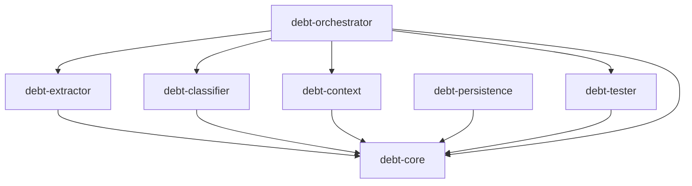
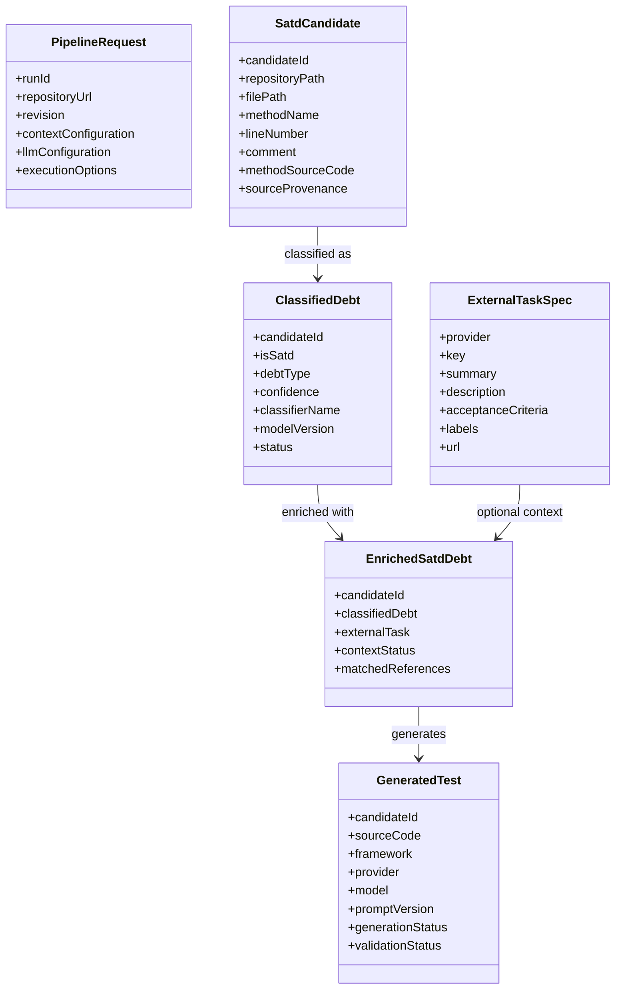
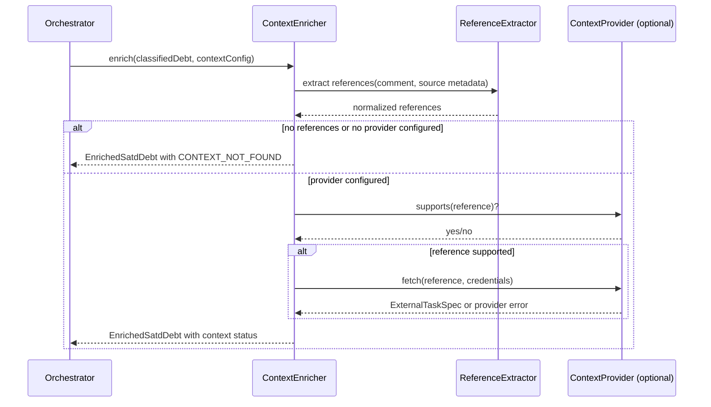
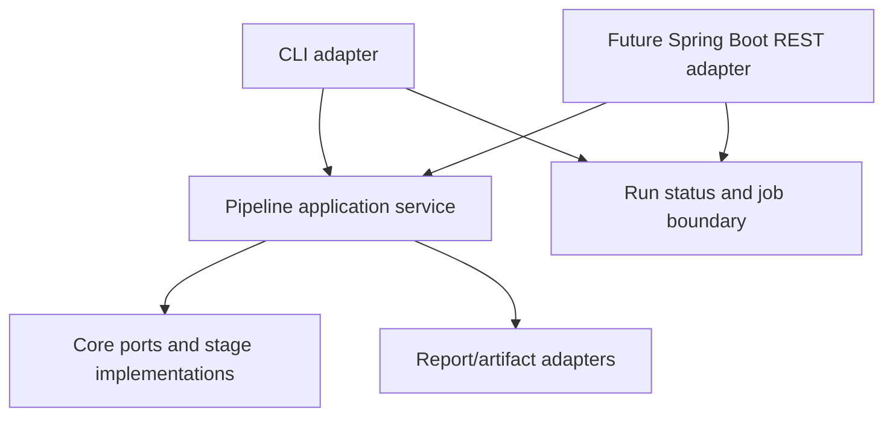

# Debt2Test Architecture

**Status:** Target architecture and migration guide

**Scope:** `debt2test` Proof of Concept and its planned evolution into a service-oriented pipeline

**Audience:** Contributors, researchers, reviewers, and AI assistants helping design or implement future features

## 1. Purpose

Debt2Test automates the discovery and repayment of Self-Admitted Technical Debt (SATD) in Java projects.

The target pipeline accepts a Java repository, extracts source-code context and SATD candidates, classifies the candidates, enriches them with specifications from external systems such as Jira, and generates candidate JUnit tests using an LLM.

The architecture must support:

- Replacing Git, AST, classifier, issue-tracker, and LLM providers independently.
- Running the same use case from a command-line interface and a future Spring Boot API.
- Preserving enough context and provenance for academic evaluation and reproducibility.
- Returning partial results when one item or one optional provider fails.
- Adding new context providers without changing the extractor, classifier, or tester.
- Moving from the current file-oriented POC to a decoupled application without a big-bang rewrite.

This document describes the **goal architecture**.

## 2. Architectural Direction

Debt2Test will use a modular **ports-and-adapters** architecture.

The domain contracts are defined in `debt-core`. Feature modules implement those contracts, while `debt-orchestrator` composes the implementations into a pipeline. Concrete integrations such as JGit, JavaParser, Weka, Jira HTTP clients, and LLM APIs remain at the edges of the system.

The key rule is:

> Feature modules communicate through `debt-core` contracts. They do not call each other directly.

The initial runtime can remain a synchronous CLI. The application boundary must nevertheless model a pipeline run and its lifecycle so that asynchronous execution and REST endpoints can be added later without changing the domain flow.

## 3. Goals and Non-Goals

### 3.1 Goals

- Extract method-level SATD candidates from Java repositories using AST parsing.
- Classify candidates using a replaceable classification strategy.
- Enrich classified debt with external specifications using replaceable context providers.
- Generate candidate JUnit 5 tests using a replaceable LLM provider.
- Produce structured results with source locations, evidence, provenance, statuses, and generated artifacts.
- Make each pipeline stage independently testable with fake ports.
- Keep provider credentials out of domain objects, logs, and generated reports.
- Support deterministic local execution for experiments and repeatable research runs.
- Provide a migration path from the existing modules and JSON artifacts.

### 3.2 Non-Goals for the POC

- Automatically committing generated tests to the analyzed repository.
- Automatically applying generated tests or modifying production source code.
- Guaranteeing that an LLM-generated test is correct or compilable without validation.
- Implementing every issue tracker or LLM provider in the first iteration.
- Building a distributed message-broker architecture before the single-process workflow requires it.
- Treating a model prediction as ground truth without preserving its model and preprocessing provenance.

## 4. Target Repository Structure

The target Maven reactor contains seven modules:

```text
debt2test/
├── pom.xml
├── architecture.md
├── debt-core/
│   ├── pom.xml
│   └── src/main/java/.../core/
│       ├── model/
│       ├── port/
│       └── error/
├── debt-extractor/
│   ├── pom.xml
│   └── src/main/java/.../extractor/
├── debt-classifier/
│   ├── pom.xml
│   └── src/main/java/.../classifier/
├── debt-context/
│   ├── pom.xml
│   └── src/main/java/.../context/
│       ├── extraction/
│       ├── chain/
│       └── provider/
├── debt-tester/
│   ├── pom.xml
│   └── src/main/java/.../tester/
│       ├── prompt/
│       └── provider/
├── debt-persistence/
│   ├── pom.xml
│   ├── src/main/resources/db/migration/
│   └── src/main/java/.../persistence/
│       ├── entity/
│       ├── repository/
│       ├── mapper/
│       ├── adapter/
│       └── config/
├── debt-orchestrator/
│   ├── pom.xml
│   └── src/main/java/.../orchestrator/
│       ├── application/
│       ├── cli/
│       ├── configuration/
│       └── reporting/
├── preTrainedModels/
└── output/
```

The exact package names may evolve, but the dependency direction and responsibilities are architectural constraints.

## 5. Maven Dependency Rules

The intended compile-time dependency graph is:



Rules:

1. `debt-core` depends on no Debt2Test module and no provider SDK.
2. `debt-extractor`, `debt-classifier`, `debt-context`, and `debt-tester` depend on `debt-core`, not on one another.
3. `debt-orchestrator` is the only module that assembles concrete stage implementations.
4. The orchestrator must depend on stage interfaces and public factories, not on internal implementation classes where avoidable.
5. JSON serialization, CLI arguments, Spring annotations, HTTP clients, Weka, JavaParser, JGit, and dotenv configuration belong outside `debt-core`.
6. A generated JSON file is an external artifact, not an internal module-to-module API.
7. No module may reach into another module's `src`, `target`, output directory, or private implementation package.

## 6. Module Responsibilities

### 6.1 `debt-core`

`debt-core` is the stable language shared by the pipeline. It contains domain models, value objects, ports, status types, and errors.

It must not know whether a result came from Jira, GitHub, Weka, OpenAI, or a mock implementation.

Responsibilities:

- Define immutable or controlled-mutation domain records.
- Define stage contracts used by the orchestrator.
- Define provider-neutral configuration objects.
- Define item-level and run-level statuses.
- Define structured errors and provenance fields.
- Define identifiers and correlation fields used to connect pipeline stages.

It must not:

- Parse Java source.
- Perform HTTP requests.
- Load Weka models.
- Read environment variables.
- Write files.
- Depend on Gson or a provider SDK solely for serialization.

### 6.2 `debt-extractor`

The extractor retrieves the target source and creates SATD candidates.

Responsibilities:

- Clone or otherwise obtain a repository using a repository adapter.
- Select a branch, tag, or commit when requested.
- Traverse Java source files.
- Parse source with JavaParser.
- Associate comments with methods and source locations.
- Capture method source and enough surrounding metadata for later context enrichment and test generation.
- Return item-level extraction errors without stopping unrelated files when possible.

The extractor should expose a core port implementation such as `SatdExtractor`. JGit and JavaParser must remain implementation details of this module.

The target extractor should prefer repository-relative paths over machine-specific absolute paths. An absolute temporary path may be retained as execution metadata but must not be the primary report identity.

### 6.3 `debt-classifier`

The classifier evaluates extracted candidates and produces classified debt.

Responsibilities:

- Implement the `DebtClassifier` port.
- Support a mock or deterministic keyword strategy for local development.
- Load the DebtHunter binary and multi-class Weka models through an adapter.
- Preserve model version, strategy name, confidence, and preprocessing provenance.
- Make model incompatibility explicit instead of silently hiding it.

DebtHunter integration must verify the attribute schema and preprocessing expected by the serialized models. A heuristic fallback may be available as an explicitly selected strategy or development mode, but production-like runs must report whether the fallback was used.

The initial model source is the [DebtHunter-Tool repository](https://github.com/PandaMinore/DebtHunter-Tool). The model files, preprocessing assumptions, class-label order, and model version must be recorded as provenance when those artifacts are used in a run.

### 6.4 `debt-context`

The context module enriches classified debt with specifications from external systems.

Responsibilities:

- Extract deterministic issue references from comments, commit messages, branch names, or configured source metadata.
- Normalize references into provider-neutral identifiers.
- Route references through a provider chain or registry.
- Fetch summary, description, acceptance criteria, labels, status, and source URL when available.
- Normalize provider responses into `ExternalTaskSpec`.
- Record match status and provider provenance.
- Return an explicit unmatched result when no issue reference or provider record is found.

The initial provider can be Jira, followed by mock, GitHub Issues, Trello, or other systems. The context module must not make Jira concepts part of the shared domain model.

Recommended internal components:

- `IssueReferenceExtractor`: deterministic parsing and normalization.
- `ContextProvider`: provider port for fetching one task specification.
- `ContextProviderChain`: ordered resolution and fallback behavior.
- `JiraContextProvider`: Jira adapter.
- `MockContextProvider`: deterministic tests and offline development.

### 6.5 `debt-tester`

The tester turns enriched debt into candidate test code.

Responsibilities:

- Build provider-neutral prompts from enriched debt.
- Implement the `TestGenerator` port.
- Support OpenAI, Anthropic, Gemini, and mock providers through adapters.
- Request JUnit 5 test code with explicit output constraints.
- Normalize provider responses and remove presentation wrappers such as Markdown fences.
- Preserve provider, model, prompt version, and generation status.
- Never claim that generated code is valid without a validation stage.

The tester should receive enriched domain data instead of reading `output/debt-report.json` directly. JSON serialization remains an orchestrator/reporting concern.

### 6.6 `debt-orchestrator`

The orchestrator is the application composition root and runtime entry point.

Responsibilities:

- Parse CLI or API input into a `PipelineRequest`.
- Load configuration and resolve secrets without placing them in domain objects.
- Construct concrete adapters and inject them into the pipeline application service.
- Execute stages in the correct order.
- Correlate candidates, classifications, context, generated tests, and errors.
- Apply stage and item-level error policy.
- Persist or export reports through an output adapter.
- Expose a CLI initially and a Spring Boot REST adapter later.

The former `MainPipeline` belongs here. It must not remain inside `debt-classifier`, because sequencing all stages is an application responsibility rather than a classification responsibility.

### 6.7 `debt-persistence`

The persistence module stores pipeline runs and their artifacts in a relational database.

Responsibilities:

- Implement the `PipelineRunStore` port, one transaction per lifecycle event.
- Implement `ReportSink` as a secondary sink recording report artifact locations.
- Own the Flyway-managed schema; Hibernate validates against it and never alters it.
- Map immutable core records onto entities and back, preserving provenance and both status vocabularies.
- Sanitize repository URLs before they reach a column, since a row is as durable as a log line.

The module depends only on `debt-core`. It never calls the extractor, classifier, context, or
tester modules, and no persistence type appears in `debt-core`. Persistence is disabled by
default so the CLI and the default build require neither a database nor Docker.

## 7. Core Domain Model

The following model is conceptual. Names and fields can be refined during implementation, but the relationships should remain stable.



### 7.1 Required Domain Properties

- Each candidate has a stable `candidateId` within a pipeline run.
- Relationships use IDs rather than list position.
- Source locations use repository-relative paths and revision metadata where available.
- Optional context is represented explicitly; missing Jira data is not represented as an exception-only condition.
- Generated code carries a status and provenance record.
- Secrets are never fields of `PipelineRequest`, `ExternalTaskSpec`, reports, or logs. Provider adapters receive resolved credentials through runtime configuration.

### 7.2 Recommended Status Values

Run-level statuses:

```text
QUEUED, RUNNING, COMPLETED, COMPLETED_WITH_ERRORS, FAILED, CANCELLED
```

Item-level statuses:

```text
EXTRACTED, CLASSIFIED, NOT_SATD, CONTEXT_MATCHED,
CONTEXT_NOT_FOUND, CONTEXT_FAILED, GENERATED, GENERATION_FAILED,
VALIDATED, VALIDATION_FAILED, SKIPPED
```

Statuses should describe observable outcomes, not implementation-specific exceptions.

## 8. Core Ports

The ports below describe the intended collaboration between the orchestrator and modules. They can be represented as Java interfaces in `debt-core`.

```text
RepositoryWorkspaceProvider
    prepare(RepositoryRequest) -> RepositoryWorkspace

SatdExtractor
    extract(RepositoryWorkspace, ExtractionOptions) -> ExtractionResult

DebtClassifier
    classify(List<SatdCandidate>, ClassificationOptions) -> ClassificationResult

ContextEnricher
    enrich(List<ClassifiedDebt>, ContextRequest) -> ContextEnrichmentResult

TestGenerator
    generate(List<EnrichedSatdDebt>, TestGenerationOptions) -> TestGenerationResult

ReportSink
    write(PipelineResult, ReportOptions) -> ReportArtifact

PipelineRunStore
    runStarted(executionId, PipelineRequest)
    runIdResolved(executionId, runId)
    workspaceReady(executionId, RepositoryWorkspace)
    candidatesExtracted(executionId, List<SatdCandidate>)
    candidatesClassified(executionId, List<ClassifiedDebt>)
    contextEnriched(executionId, List<EnrichedSatdDebt>)
    testsGenerated(executionId, List<GeneratedTest>)
    runFinished(executionId, PipelineResult)
```

The repository workspace provider may be part of `debt-extractor` if cloning and extraction are inseparable in the initial POC. If the project later needs multiple source acquisition mechanisms, the port can be split without changing downstream stages.

Each port should have:

- A provider-neutral input.
- A provider-neutral result.
- Explicit item-level failures.
- A cancellation or timeout boundary where relevant.
- No dependency on CLI, REST, Gson, Weka, or Spring types.

## 9. End-to-End Data Flow

```mermaid
flowchart LR
    INPUT[CLI or REST request]
    ORCH[Pipeline application service]
    SOURCE[Repository workspace]
    EXTRACT[SatdExtractor]
    CLASSIFY[DebtClassifier]
    CONTEXT[ContextEnricher]
    TEST[TestGenerator]
    REPORT[ReportSink]
    ARTIFACTS[PipelineResult and report artifacts]

    INPUT --> ORCH
    ORCH --> SOURCE
    SOURCE --> EXTRACT
    EXTRACT -->|SatdCandidate| CLASSIFY
    CLASSIFY -->|ClassifiedDebt| CONTEXT
    CONTEXT -->|EnrichedSatdDebt| TEST
    TEST -->|GeneratedTest| REPORT
    ORCH --> REPORT
    REPORT --> ARTIFACTS
```



The orchestrator owns the sequence and correlation. No stage should invoke the next stage directly.

## 10. Context Provider Resolution

`ContextHandler` (in `debt-context`) holds at most one configured `ContextProvider`, injected as `Optional<ContextProvider>`. There is currently no live provider registered by default (`AppOrchestrator` wires `Optional.empty()`), so enrichment resolves every reference to `CONTEXT_NOT_FOUND` until a real provider adapter (e.g. Jira) is registered.



Provider resolution rules:

1. Reference extraction is deterministic and testable without network access.
2. `ContextHandler` validates the configured provider's identity once per candidate, then walks the candidate's extracted references in order against that single provider until one matches, fails non-recoverably, or the references are exhausted.
3. A provider must return normalized data or a typed failure.
4. Authentication, rate limits, and HTTP details stay inside the provider adapter.
5. A missing reference, a missing ticket, or no provider being configured is a valid `CONTEXT_NOT_FOUND` outcome.
6. Provider failures must be visible in the result and must not silently become a successful match.
7. `ContextProvider` must support a mock/fake implementation for tests and offline demonstrations.
8. Resolving references from more than one tracking system at once (provider chaining/fallback) is an open extension point, not current behavior: it would require a composite `ContextProvider` adapter in `debt-context` (behind the same port), not changes to `ContextHandler` or `debt-core`.

## 11. Orchestration and Error Policy

### 11.1 Pipeline Control

The pipeline application service should execute stages approximately as follows:

```text
1. Validate PipelineRequest.
2. Create run identity and execution metadata.
3. Prepare the repository workspace.
4. Extract candidates.
5. Classify candidates.
6. Discard or retain non-SATD items according to execution options.
7. Enrich classified SATD with external context.
8. Generate candidate tests for eligible items.
9. Optionally validate generated tests in a later stage.
10. Assemble PipelineResult.
11. Write configured report artifacts.
12. Mark the run as completed, completed with errors, or failed.
```

### 11.2 Fatal Versus Recoverable Failures

Fatal run failures include:

- Invalid repository URL or inaccessible repository when no workspace can be created.
- Missing required classifier model when the selected strategy requires it.
- Invalid pipeline configuration that prevents stage construction.
- Failure to initialize a required stage.

Recoverable item or stage failures include:

- One Java file failing to parse.
- One candidate failing classification.
- No issue key found in a comment.
- One Jira ticket being inaccessible.
- One LLM request failing.
- One generated test failing validation.

The result must preserve successful items and attach typed errors to failed items. A recoverable failure should cause `COMPLETED_WITH_ERRORS`, not an apparently successful item.

### 11.3 Retry and Timeout Policy

- Network providers must define bounded connect and request timeouts.
- Retries must be limited, observable, and restricted to transient failures.
- Authentication, validation, and malformed-request failures must not be retried automatically.
- LLM retries must respect provider rate limits and avoid duplicating expensive requests without an idempotency strategy.
- The initial CLI may use sequential execution; concurrency should be introduced only with explicit limits and deterministic result correlation.

## 12. Reporting and Artifacts

The internal pipeline uses typed domain objects. The orchestrator converts the final result into external formats.

The primary report should contain, for each candidate:

- Run ID and candidate ID.
- Repository URL and revision metadata.
- Repository-relative file path.
- Method name and source line.
- SATD comment.
- Associated method source code.
- Classification, confidence, strategy, and model version.
- Extracted issue references.
- External task specifications and provider URL when matched.
- Context status and errors.
- Generated test source code.
- Test provider, model, prompt version, and generation status.
- Optional validation result.

Recommended artifact boundaries:

```text
PipelineResult          internal application result
debt-report.json        classified/enriched debt report
debt-test-report.json   generated-test report
debt-test-report.md     human-readable presentation report
run-metadata.json       execution and provenance metadata, if needed
```

Reports must not contain API keys, authorization headers, or raw provider payloads by default. Raw payload retention, if needed for research, must be explicitly configured and stored separately with redaction rules.

## 13. CLI and Future Spring Boot API

The application service must be independent of the delivery mechanism.



### 13.1 Current CLI

The initial delivery uses a CLI entry point in `debt-orchestrator`:

```text
debt-orchestrator.Main
    -> parse arguments/configuration
    -> construct adapters
    -> call PipelineApplicationService
    -> print progress and artifact locations
```

The CLI must not be the owner of domain logic. It should be replaceable by a REST adapter.

### 13.2 Future REST API

The planned Spring Boot adapter should expose:

```http
POST /api/pipeline/runs
GET  /api/pipeline/runs/{runId}
GET  /api/pipeline/runs/{runId}/report
POST /api/pipeline/runs/{runId}/cancel
```

`POST /api/pipeline/runs` accepts repository, context-provider, classifier, tester, and execution configuration. It returns a run ID. The first implementation may execute synchronously, but the API contract should allow `202 Accepted` and asynchronous processing.

Run states should be observable without exposing provider credentials. API responses should return sanitized configuration summaries and report references, not secrets.

## 14. Security and Configuration

- Credentials must come from environment variables, secret managers, or injected runtime configuration.
- `.env` files must remain local and must not be committed with real credentials.
- Logs must redact authorization headers, API keys, and sensitive ticket fields when configured.
- Repository URLs may contain credentials; they must be sanitized before logging and reporting.
- External descriptions and source code are untrusted prompt input. Prompt construction should clearly separate instructions from retrieved content.
- Generated source code must be treated as untrusted output until validated and reviewed.
- Provider-specific configuration belongs in adapter configuration, not in shared domain records.

## 15. Testing Strategy

Testing is organized around the module boundaries.

### 15.1 `debt-core`

- Value-object validation tests.
- Serialization contract examples if report schemas are defined here indirectly.
- Status transition and error-model tests.

### 15.2 `debt-extractor`

- Java fixture files with method comments, inline comments, nested classes, malformed files, and overloaded methods.
- Repository acquisition tests using a local fixture repository or fake workspace provider.
- Assertions for repository-relative paths and source locations.

### 15.3 `debt-classifier`

- Mock classifier tests with deterministic keyword inputs.
- Weka model contract tests using the checked-in or test fixture models.
- Tests that fail visibly when model attributes or class labels are incompatible.
- Provenance tests confirming strategy and model metadata are preserved.

### 15.4 `debt-context`

- Issue-key extraction tests for Jira-style keys, GitHub-style references, false positives, and multiple references.
- Single-provider resolution tests using a mock/fake `ContextProvider`.
- HTTP contract tests for Jira using a local mock server.
- Tests for unmatched, unauthorized, rate-limited, and malformed responses.

### 15.5 `debt-tester`

- Prompt construction tests with and without external task context.
- Mock LLM provider tests.
- Provider response parsing tests with fenced and unfenced code.
- Tests confirming failures are recorded rather than converted into successful generated tests.

### 15.6 `debt-orchestrator`

- Pipeline tests with fake implementations of every core port.
- Tests for stage ordering and ID correlation.
- Tests for fatal and recoverable failures.
- Golden-file tests for report output.
- End-to-end tests using a small fixture repository and mock context/LLM providers.

The test suite must not require live Jira, GitHub, OpenAI, Anthropic, or Gemini credentials.

## 16. Migration Plan From the Current POC

The migration should be incremental. At each phase, the existing CLI behavior should remain runnable unless the phase explicitly replaces it.

### Phase 1: Establish `debt-core`

- Add shared domain models and ports.
- Move the conceptual data represented by `SatdCandidate`, `ClassifiedDebt`, and tester report items into core types.
- Define statuses, provenance, errors, and run identifiers.
- Add unit tests for the new contracts.

### Phase 2: Decouple extraction and classification

- Change `debt-extractor` to implement the core extraction port.
- Change `debt-classifier` to implement the core classification port.
- Remove the direct `debt-classifier -> debt-extractor` dependency.
- Move model paths and classification strategy selection into configuration.
- Keep a compatibility adapter only where needed to preserve the current CLI during migration.

### Phase 3: Introduce `debt-orchestrator`

- Move `MainPipeline` from `debt-classifier` to the orchestrator module.
- Inject stage implementations through core ports.
- Replace direct method calls between feature modules with orchestration calls.
- Make report generation an orchestrator/output responsibility.

### Phase 4: Add `debt-context`

- Add issue-reference value objects and context ports to core.
- Implement deterministic reference extraction.
- Implement a mock context provider first.
- Implement Jira as the first external provider.
- Add explicit unmatched and provider-error results.

### Phase 5: Migrate `debt-tester`

- Change tester input from JSON-file coupling to `EnrichedSatdDebt`.
- Keep OpenAI, Anthropic, Gemini, and mock implementations behind the tester provider port.
- Add external task context to prompt construction.
- Preserve JSON/Markdown output through the orchestrator report adapter.

### Phase 6: Add validation and operational controls

- Add optional generated-test compilation and JUnit execution as a separate validation stage.
- Add timeouts, bounded retries, cancellation, and run metadata.
- Add structured logging and sanitized error reporting.

### Phase 7: Add the Spring Boot adapter

- Introduce REST controllers in `debt-orchestrator` or a dedicated delivery module if the application grows significantly.
- Reuse the pipeline application service.
- Add a run store and asynchronous executor only when the UI workflow requires it.

## 17. Contribution Guide

Contributors should use these rules when proposing a new feature or provider.

### Adding a New Context Provider

1. Define or reuse provider-neutral types in `debt-core`.
2. Implement the provider in `debt-context`.
3. Keep HTTP, authentication, pagination, and response mapping inside the provider adapter.
4. Add mock-based unit and contract tests.
5. Register the provider in orchestrator configuration, not through hardcoded branching inside unrelated modules.
6. Add provenance and error mapping for provider-specific failures.

### Adding a New LLM Provider

1. Implement the tester provider contract.
2. Keep request payloads, authentication, model naming, and response parsing inside the adapter.
3. Use the shared prompt model and report provenance.
4. Add tests with recorded or synthetic responses, never live credentials.
5. Add explicit configuration and rate-limit behavior.

### Adding a New Pipeline Stage

1. Define its input and output in `debt-core`.
2. Keep the stage independent of sibling feature modules.
3. Add the stage port and fake implementation tests.
4. Wire it in `debt-orchestrator`.
5. Define fatal and recoverable failures.
6. Add result provenance and report fields before implementation is merged.

### Changes That Need Architectural Review

Discuss the change before implementation when it:

- Adds a dependency from one feature module to another.
- Adds a third-party dependency to `debt-core`.
- Changes the meaning or identity of a report field.
- Introduces a provider-specific type into a shared domain model.
- Makes a network call from a domain object or pipeline stage without a port.
- Changes run or item status semantics.
- Introduces asynchronous or concurrent execution.
- Stores credentials or raw external payloads in reports.

## 18. Architecture Decision Rules for AI-Assisted Work

When asking an AI assistant to design or implement a feature, provide:

- The relevant module and its allowed dependencies.
- The core input and output types involved.
- Whether the feature is a domain rule, adapter, orchestration rule, or delivery concern.
- Expected failure behavior and whether failures are item-level or run-level.
- Required provenance and report changes.
- Test boundaries and whether live external systems are prohibited.

The assistant should be instructed to:

1. Inspect the current repository before proposing changes.
2. Treat this document as the target architecture, not proof that every target module already exists.
3. Avoid using JSON files as internal module contracts.
4. Avoid direct dependencies between extractor, classifier, context, and tester.
5. Keep provider-specific details behind adapters.
6. Preserve partial results and explicit errors.
7. Add or update tests at the affected boundary.
8. Report any conflict between the current transitional code and this architecture.

## 19. Open Decisions

The following decisions should be made in implementation plans rather than assumed silently:

- Whether the repository workspace provider remains inside `debt-extractor` or becomes a separate adapter module.
- ~~Whether reports are written locally only or through a storage port for the future service.~~ **Resolved:** both. `FileReportSink` stays the primary sink (it produces the paths `validArtifact` requires); `DatabaseReportSink` runs alongside it under `CompositeReportSink`.
- Whether generated-test validation is a separate `debt-validator` module or an optional stage inside `debt-tester`.
- ~~Whether asynchronous execution requires a persistent run store or can initially use in-memory state.~~ **Resolved:** a persistent run store. `debt-core` defines the `PipelineRunStore` port; `debt-persistence` implements it over PostgreSQL. See `docs/superpowers/specs/2026-09-08-database-persistence-layer-design.md`.
- Whether Java 25 remains the supported build baseline. The current repository POM uses Java 25; Maven, VS Code, CI, and contributor documentation must agree on the selected version.
- Whether raw provider payloads are retained for research reproducibility, and what redaction policy applies.

Open decisions must be resolved with an ADR or an updated implementation plan before they become implicit contracts.

## 20. Success Criteria

The target architecture is considered implemented when:

- The six Maven modules build as a reactor.
- `debt-core` has no dependency on feature modules or external provider SDKs.
- Extractor, classifier, context, and tester modules compile independently against core contracts.
- The orchestrator can run the complete pipeline using only mock providers.
- A Jira provider can be added without changing extractor or classifier code.
- An LLM provider can be added without changing orchestration logic.
- The same application service can be invoked by the CLI and a future REST adapter.
- Reports preserve source location, classification, context, generation status, errors, and provenance.
- No API credential is written to logs or artifacts.
- Unit and component tests run without live external credentials.
- A failed provider or item produces an explicit partial result rather than silent data loss.
